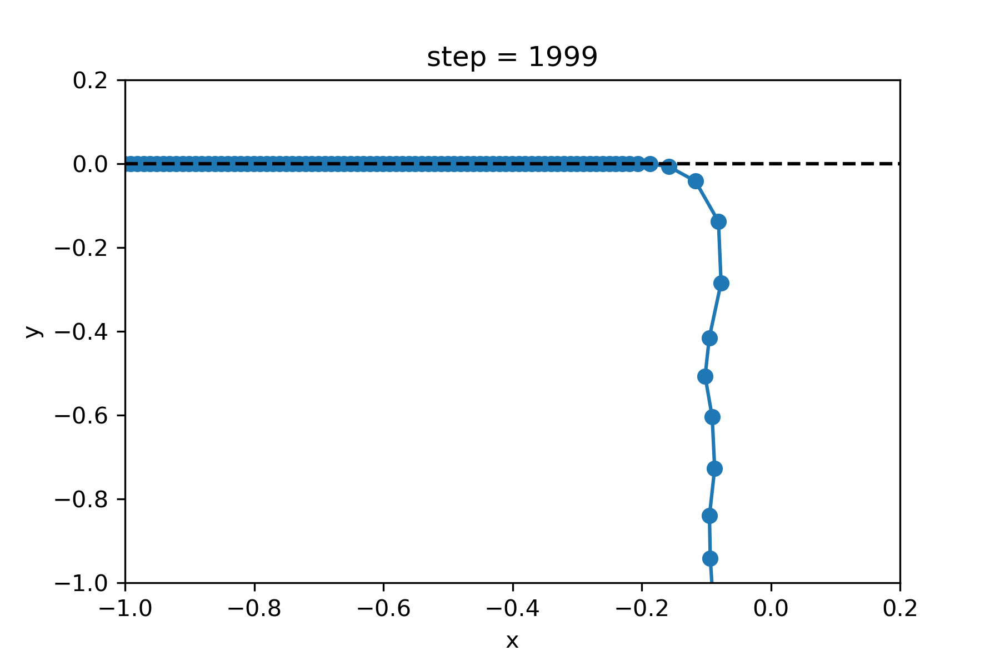
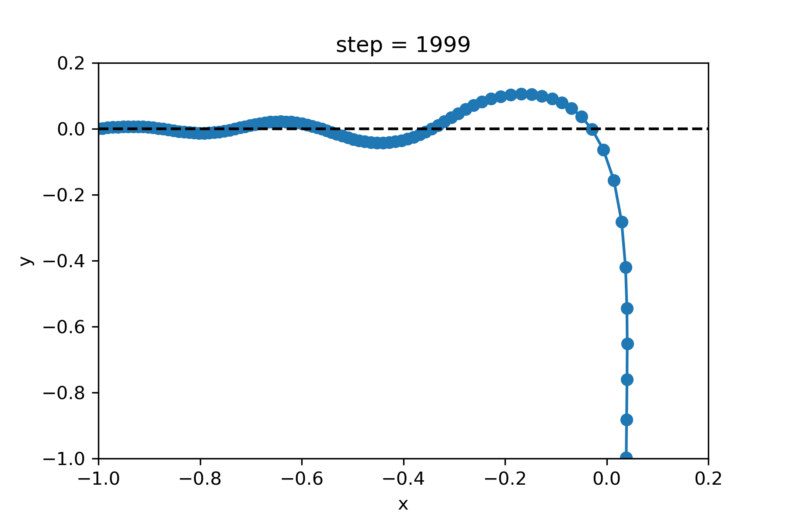

# Simulation of the Mould effect
The repository contains the code and results for a simulation of a chain of beads. The beads are linked together by a spring and constrainted to a 2D plane. The first bead is pulled with a constant force. The simulations show that some rigidity in the bond angle is necessary in this simplified context to have the chain fountain effect.

## Context
I wanted to simulated this effect after watching the videos of on the dispute between ElectroBOOM and Steve Mould. You can find the videos here:

ElectroBOOM: https://www.youtube.com/watch?v=hx2LEqTQT4E

Steve Mould: https://www.youtube.com/watch?v=qTLR7FwXUU4

## Results
### Simulation of a chain of beads *without* a bond angle potential

### Simulation of a chain of beads *with* a bond angle potential

## Requirements
The simulation was performed using JAX (https://github.com/google/jax) for the automatic gradient. The plots are generated with matplotlib (https://matplotlib.org/).
