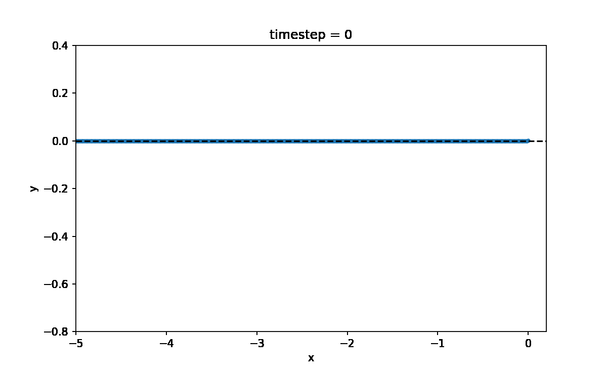
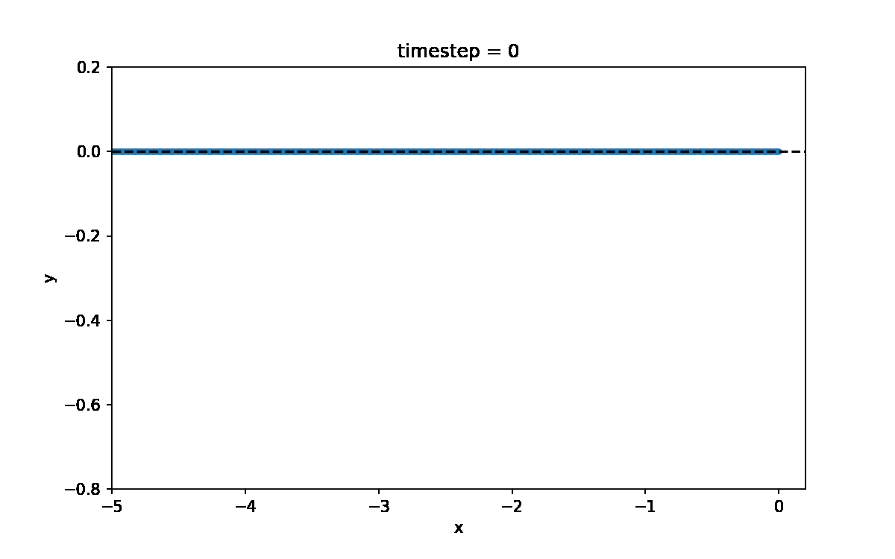

# Simulation of the Mould effect
The repository contains the code and results for a simulation of a chain of beads. The beads are linked together by a spring and constrainted to a 2D plane. The first bead is pulled with a constant force. The simulations show that some rigidity in the bond angle is necessary in this simplified context to have the chain fountain effect.

## Context
I wanted to simulated the chain fountain effect after watching the videos of on the dispute between ElectroBOOM and Steve Mould. You can find the videos here:

ElectroBOOM: https://www.youtube.com/watch?v=hx2LEqTQT4E

Steve Mould: https://www.youtube.com/watch?v=qTLR7FwXUU4

## Simulation setup
The chain of beads is initialized in a line on the x-axis. The first bead of the chain is at the position (0,0). The beads are connected to the next and previous one in the chain by a spring with constant *kl*. Initially, all the beads are spaced by the bond lenght *d0*. At the start of the simulation, the first bead is pulled at a fixed acceleration *g* downward in the y-axis direction.

In addition, the chain rigidity can be tuned with an harmonic bond angle potential with constant *kt* between all triplet of connected beads. The motion can be quickstarted by setting the velocity of the first bead *vy0* upward in the y-axis direction.

## Results
### 1.1 Simple chain
- No ridigidy.
- Starting from a standstill.

### 1.2 Chain with rigidity
- Bond angle potential.
- Starting from a standstill.

### 1.3 Chain with higher rigidity
- Increased bond angle constant.
- Starting from a standstill.

### 2.1 Simple chain with quickstart
- No ridigidy.
- First bead has some velocity upward in the y-axis direction.

### 2.2 Chain with rigidity and quickstart
- Bond angle potential.
- First bead has some velocity upward in the y-axis direction.

### 2.3 Lower rigidity chain with quickstart
- Decreased bond angle constant.
- First bead has some velocity upward in the y-axis direction.

## Requirements
The simulation was performed using PyTorch (https://pytorch.org/) for the automatic gradient. The plots are generated with matplotlib (https://matplotlib.org/). The gifs are generated with imageio.
